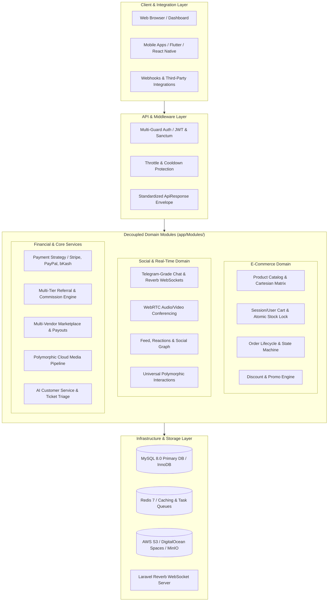

# ⚡ OmniCore — Enterprise Modular Backend & E-Commerce Platform

<p align="center">
  
</p>

<p align="center">
  
  
  
  
  
  
  
  
</p>

---

## 📖 Executive Summary

**OmniCore** is a production-grade, enterprise backend and application ecosystem built on **Laravel 12** and **PHP 8.4** utilizing a **Modular Monolith Architecture**. Engineered for high-scale applications requiring concurrency-safe e-commerce, real-time messaging, WebRTC calling, universal polymorphic interactions, automated audit trails, and multi-gateway payment integrations.

Designed following strict Clean Architecture, Domain-Driven Design (DDD) principles, and SOLID design patterns.

---

## 🏛️ System Architecture Diagram



---

## 🌟 Key Enterprise Engineering Highlights

### 🛍️ 1. Shopify-Grade E-Commerce & Atomic Checkout
* **Cartesian Variant Matrix Generator**: Computes attribute combinations (e.g. `[Color] × [Size] × [Storage]` ➔ variants generated with custom SKU algorithms, individual barcodes, and stock levels).
* **Concurrency-Safe Atomic Checkout**: Uses **Database Transactions** and **Row-Level Pessimistic Locking (`lockForUpdate()`)** to prevent race-condition overselling under high concurrency.
* **Order Lifecycle State Machine**: Strict enum-backed transitions (`Pending -> Confirmed -> Processing -> Shipped -> Delivered`) with automatic stock rollback if an order is cancelled or refunded.
* **Smart Cart Engine**: Unauthenticated guest token carts seamlessly merge into user database carts upon login.

### 💳 2. Payment Gateway Strategy Pattern
* Decoupled driver architecture implementing `PaymentGatewayInterface`:
  - **Stripe** (Payment Intents & Webhooks)
  - **PayPal** (v2 Orders API)
  - **bKash** (Tokenized Checkout)
  - **SSLCommerz** (Hosted Gateway)
  - **In-App User Wallet** & **Manual Bank Transfer**

### 💬 3. Telegram-Grade Real-Time Chat & WebRTC Calling
* **Laravel Reverb & WebSockets**: Instant message delivery, typing indicators, read receipts, and online status broadcasting.
* **WebRTC Calling Engine**: Peer-to-peer signaling for audio/video calling and screen sharing with automated call duration logs.

### 🌟 4. Universal Polymorphic Interaction Engine (`app/Modules/Interaction`)
* **Reusable Headless Package**: Can be dropped into any Model (Posts, Products, Courses, Comments) via Trait `HasInteractions`.
* **Features**: Multi-Reaction Likes, Nested Comments & Replies with admin moderation, Multi-Collection Bookmarks/Wishlists, Anti-Spam Cooldown Views Analytics, and SEO/Expiring Private Share Links.
* **Reusable Blade UI Components**: Embeddable metric cards and moderation tables (`<x-interaction::stats-card />`, `<x-interaction::comments-table />`).

---

## 🛠️ Technology Stack & Standards

| Layer | Technology / Tool | Purpose |
|---|---|---|
| **Framework** | Laravel 12.x / PHP 8.4+ | Core application runtime & IOC container |
| **Static Analysis** | **PHPStan (Level 5 / 0 Errors)** | Strict type checking & zero runtime bugs |
| **Code Style** | **Laravel Pint** | PSR-12 strict formatting across all modules |
| **CI / CD** | **GitHub Actions** | Automated linting, static analysis, & PHPUnit suite |
| **API Documentation** | **Scribe & OpenAPI 3.0** | Interactive API Playground & Postman Collections |
| **Real-time Engine** | **Laravel Reverb / WebSockets** | High-concurrency event broadcasting |
| **Database & Cache** | MySQL 8.0+ / Redis 7 | Relational storage & sub-millisecond cache/queue |
| **Containerization** | Docker & Docker Compose | 1-command reproducible production environment |

---

## 📚 Interactive API Documentation

Interactive API Reference is powered by **Scribe & OpenAPI 3.0**:

- **Live Web Documentation**: Access `/docs` in your browser for the interactive Swagger/Scribe UI.
- **Postman Collection**: Generated at `storage/app/private/scribe/collection.json` (ready for import).
- **OpenAPI Specification**: Available at `storage/app/private/scribe/openapi.yaml`.

To regenerate the documentation:
```bash
php artisan scribe:generate --force
```

---

## ⚡ Quick Start & Installation

### Option A: Local Setup (PHP 8.4 + Composer)

```bash
# 1. Clone repository
git clone https://github.com/your-username/OmniCore.git
cd OmniCore

# 2. Install dependencies
composer install
npm install && npm run build

# 3. Environment configuration
cp .env.example .env
php artisan key:generate
php artisan jwt:secret

# 4. Migrate & Load Rich Demo Data
php artisan migrate --seed

# 5. Start Development Server & WebSocket Server
php artisan serve
php artisan reverb:start
```

### Option B: Docker Compose

```bash
# Start all services (PHP 8.4, Nginx, MySQL, Redis, Reverb, Mailpit)
docker compose up -d

# Run migrations & seed demo dataset
docker compose exec app php artisan migrate --seed
```

---

## 🧪 Testing & Code Quality Verification

```bash
# Run PHPUnit Automated Test Suite
php artisan test

# Run PHPStan Static Analysis (0 Errors)
vendor/bin/phpstan analyse --memory-limit=1G

# Verify Code Style (Laravel Pint)
vendor/bin/pint --test
```

---

## 📜 License

This project is open-sourced software licensed under the [MIT license](LICENSE).