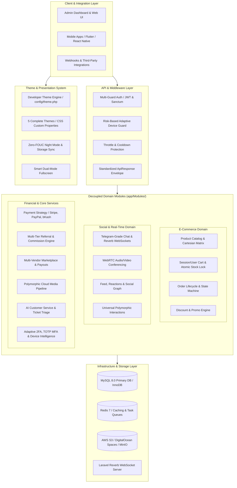

# ⚡ OmniCore — Enterprise Modular Backend & Multi-Theme Platform

<p align="center">
  
</p>

<p align="center">
  
  
  
  
  
  
  
  
  
</p>

---

## 📖 Executive Summary

**OmniCore** is a production-grade, enterprise backend and application ecosystem built on **Laravel 12** and **PHP 8.4** utilizing a **Modular Monolith Architecture**. Engineered for high-scale applications requiring concurrency-safe e-commerce, real-time messaging, WebRTC calling, universal polymorphic interactions, automated audit trails, multi-gateway payment integrations, an enterprise **Multi-Theme Design Engine**, and a bank-grade **Adaptive Authentication (2FA/TOTP)** framework.

Designed following strict **Clean Architecture**, **Domain-Driven Design (DDD)** principles, thin web controllers, and SOLID patterns.

---

## 🏛️ System Architecture Diagram


```mermaid
flowchart TB
    subgraph ClientLayer["Client & Integration Layer"]
        Web[Admin Dashboard & Web UI]
        Mobile[Mobile Apps / Flutter / React Native]
        ThirdParty[Webhooks & Third-Party Integrations]
    end

    subgraph GatewayLayer["API & Middleware Layer"]
        AuthGuard[Multi-Guard Auth / JWT & Sanctum]
        AdaptiveGuard[Risk-Based Adaptive Device Guard]
        RateLimit[Throttle & Cooldown Protection]
        ResponseEnvelope[Standardized ApiResponse Envelope]
    end

    subgraph ThemeAndUI["Theme & Presentation System"]
        ThemeEngine[Developer Theme Engine / config/theme.php]
        DesignTokens[5 Complete Themes / CSS Custom Properties]
        NightMode[Zero-FOUC Night Mode & Storage Sync]
        FullscreenEngine[Smart Dual-Mode Fullscreen]
    end

    subgraph DomainModules["Decoupled Domain Modules (app/Modules/)"]
        direction TB
        subgraph Commerce["E-Commerce Domain"]
            ProductModule[Product Catalog & Cartesian Matrix]
            CartModule[Session/User Cart & Atomic Stock Lock]
            OrderModule[Order Lifecycle & State Machine]
            CouponModule[Discount & Promo Engine]
        end

        subgraph SocialAndRealtime["Social & Real-Time Domain"]
            ChatModule[Telegram-Grade Chat & Reverb WebSockets]
            CallModule[WebRTC Audio/Video Conferencing]
            PostModule[Feed, Reactions & Social Graph]
            InteractionModule[Universal Polymorphic Interactions]
        end

        subgraph FinancialAndCore["Financial & Core Services"]
            PaymentModule[Payment Strategy / Stripe, PayPal, bKash]
            AffiliateModule[Multi-Tier Referral & Commission Engine]
            VendorModule[Multi-Vendor Marketplace & Payouts]
            MediaModule[Polymorphic Cloud Media Pipeline]
            AIModule[AI Customer Service & Ticket Triage]
            AdaptiveAuthModule[Adaptive 2FA, TOTP MFA & Device Intelligence]
        end
    end

    subgraph InfrastructureLayer["Infrastructure & Storage Layer"]
        MySQL[(MySQL 8.0 Primary DB / InnoDB)]
        Redis[(Redis 7 / Caching & Task Queues)]
        CloudStorage[(AWS S3 / DigitalOcean Spaces / MinIO)]
        ReverbWS[Laravel Reverb WebSocket Server]
    end

    ClientLayer --> GatewayLayer
    ClientLayer --> ThemeAndUI
    GatewayLayer --> DomainModules
    DomainModules --> InfrastructureLayer
```

---

## 📂 Repository Directory Structure

```text
OmniCore/
├── app/
│   ├── Http/
│   │   ├── Controllers/
│   │   │   ├── Api/                     # REST API Controllers (Sanctum / JWT)
│   │   │   └── Web/Backend/             # Thin, clean Admin Controllers (Users, Roles, Dashboard, etc.)
│   │   ├── Middleware/                  # HTTP Gateways, Trusted Proxies, Localization
│   │   └── Requests/                    # Strict FormRequest Validations
│   ├── Models/                          # Core Eloquent Models & Relations
│   ├── Modules/                         # Self-Contained Domain Modules (Modular Monolith)
│   │   ├── AdaptiveAuth/                # Device Fingerprinting, Risk Challenges & TOTP MFA
│   │   ├── Interaction/                 # Polymorphic Likes, Comments, Bookmarks & Views
│   │   └── ...                          # Commerce, Chat, Order, and Media Modules
│   ├── Services/                        # Business Logic & Single-Responsibility Services
│   └── Support/                         # Helper Classes, Enums & Value Objects
├── config/
│   ├── theme.php                        # Multi-Theme Registry & Active Theme Configuration
│   ├── adaptive_auth.php                # Adaptive Auth, TOTP & Device Risk Policies
│   └── ...
├── public/
│   └── backend/
│       ├── css/
│       │   ├── themes.css               # 5-Theme Design Tokens, Dark Mode & UI Engine
│       │   ├── style.css                # Base Bootstrap 5 UI Styles
│       │   └── skin-modes.css           # Template Layout Utilities
│       └── js/                          # Plugins (Sidemenu, PerfectScrollbar, Datatables, etc.)
├── resources/
│   ├── views/
│   │   ├── backend/                     # Admin Dashboard Views & Clean Layouts
│   │   │   ├── partials/
│   │   │   │   ├── _header.blade.php    # Navbar with Night Mode & Fullscreen Controls
│   │   │   │   ├── _sidebar.blade.php   # Dynamic Sidebar Menu
│   │   │   │   ├── _notification.blade.php # Notification Dropdown Hub
│   │   │   │   ├── _styles.blade.php    # CSS Includes & Zero-FOUC Dark Mode Initializer
│   │   │   │   ├── _scripts.blade.php   # Core Scripts & Plugin Loaders
│   │   │   │   └── _custom-script.blade.php # Night Mode & Smart Fullscreen Controllers
│   │   │   ├── access/                  # User & Role Management Views
│   │   │   └── dashboard.blade.php      # Main KPI Analytics Dashboard
│   │   └── layouts/                     # Master Blade Layout Templates
│   └── js/                              # Vite Frontend Bundle Entrypoint
├── routes/
│   ├── web.php                          # Web Authentication & Route Definitions
│   ├── api.php                          # Public & Protected REST API Routes
│   ├── admin.php                        # Protected Backend Admin Panel Routes
│   └── channels.php                     # Laravel Reverb Broadcast Channels
└── tests/
    ├── Feature/                         # Feature & HTTP Integration Tests
    └── Unit/                            # Isolated Service & Model Unit Tests
```

---

## 🎨 1. Enterprise Multi-Theme Design System

OmniCore features an industrial-grade **5-Theme Design Token Architecture** built directly into [`config/theme.php`](file:///config/theme.php) and [`public/backend/css/themes.css`](file:///public/backend/css/themes.css).

### 🛠️ Developer-First Theme Configuration
The active theme is strictly controlled by the developer via `.env` or the Artisan CLI (UI users/admins cannot manipulate the design):

```env
# Set the active theme in .env (Default: modern_indigo)
APP_THEME=modern_indigo
```

CLI Theme Management:
```bash
# List all registered themes with their status and color palettes
php artisan theme:list

# Switch the application theme instantly
php artisan theme:set dark_luxury
php artisan theme:set glassmorphism
php artisan theme:set minimalist_clean
php artisan theme:set corporate_blue
php artisan theme:set modern_indigo
```

### 🎭 5 Registered Themes Overview

| Theme Key | Name | Category | Primary Accent | Aesthetic Character |
|---|---|---|---|---|
| `modern_indigo` | **Modern Indigo** *(Default)* | Modern SaaS | `#6366f1` (Indigo) | High-converting SaaS aesthetic with smooth shadows, indigo brand gradients, and balanced typography. |
| `glassmorphism` | **Glassmorphism Frosted** | Futuristic Glass | `#a855f7` (Purple) | Translucent frosted cards (`backdrop-filter: blur(12px)`), luminous neon glows, and glass border accents. |
| `dark_luxury` | **Dark Luxury OLED** | Luxury OLED Dark | `#38bdf8` (Cyan) | Deep obsidian slate backgrounds (`#0a0f1d`), neon cyan indicators, and warm gold financial highlights. |
| `minimalist_clean` | **Minimalist Clean** | Minimalist Monochrome | `#0f172a` (Slate 900) | Notion & Japanese-inspired ultra-clean monochrome, hairline borders (`1px solid #e2e8f0`), zero visual noise. |
| `corporate_blue` | **Corporate Blue & Slate** | Enterprise Fintech | `#1d4ed8` (Royal Blue) | Institutional fintech trust aesthetic featuring executive navy sidebars and royal blue primary buttons. |

Every theme dynamically controls:
* CSS Tokens (`--primary-bg-color`, `--secondary-bg-color`, `--theme-body-bg`, etc.)
* Sidebar active/inactive text contrast and hover states
* Card borders, border radiuses, and shadow elevations
* Badges, counter icon gradients, and metric boxes
* Tables, hover stripes, and form inputs

---

## 🌙 2. Night Mode (Dark Mode) Engine

OmniCore includes a built-in **Night Mode Toggle** in the top navigation bar with persistent client synchronization:

* **Persistent State**: User preference is stored in `localStorage ('omnicore_dark_mode')` and persists across browser tabs, sessions, and page reloads.
* **Zero-FOUC (Flash of Unstyled Content)**: An inline script in the `<head>` tag checks and applies `dark-mode` to `<html>` and `<body>` prior to rendering.
* **Dynamic Sun / Moon Icons**: The navbar icon instantly alternates between Moon (in light mode) and golden Sun (in dark mode) with smooth micro-animations.
* **Universal Color Re-mapping**: Deep dark obsidian background (`#0b0f19`), dark slate cards (`#111827`), accessible text contrast (`#f8fafc` / `#cbd5e1`), and customized dark tables/inputs.

---

## 🖥️ 3. Smart Dual-Mode Fullscreen System

The navbar fullscreen button (`#fullscreen-toggle`) is powered by an intelligent dual-mode controller:

1. **Native HTML5 Fullscreen**: Leverages `requestFullscreen()` with complete cross-browser vendor fallbacks (`webkit`, `moz`, `ms`) for true OS-level fullscreen (hiding browser chrome, address bar, and OS taskbar).
2. **Instant Full-Window Fallback**: If the browser environment, iframe, or webview restricts native OS window resizing (e.g., inside an IDE web preview or secure iframe), the controller automatically activates **Full-Window Presentation Mode (`body.fullscreen-window-fallback`)**, expanding the entire dashboard to `100vw × 100vh` without throwing errors.
3. **Interactive Icon Transitions**: SVG corners expand in normal mode and contract in fullscreen mode.
4. **Keyboard & Event Sync**: Listening to `fullscreenchange` and keyboard `ESC` key events guarantees the UI state remains synchronized at all times.

---

## 🔔 4. Notification Hub & Management

* **Full-Width Flyout Menu**: Expanded dropdown width for clear reading of multi-line system alerts and audit logs.
* **Quick Actions**: Individual inline mark-as-read (check icon) and delete (trash icon) buttons for immediate triage.
* **Cursor Pagination Style**: Built for infinite or smooth cursor-based pagination through past notifications.

---

## 🛡️ 5. Enterprise Adaptive Authentication & TOTP MFA (`app/Modules/AdaptiveAuth`)

A bank-grade security module providing **Risk-Based Adaptive Device Intelligence**, **Time-Based One-Time Password (TOTP) MFA**, and **Session/Device Management** following NIST SP 800-63B guidelines.

### 🔑 Key Capabilities:
* **Polymorphic Binding**: Seamlessly attaches to any authenticatable model (`User`, `Admin`, `Staff`, `Vendor`) via `HasAdaptiveAuth`.
* **Risk-Based Device Intelligence**: Fingerprints hardware, browser, and IP geolocation. Recognized devices enjoy frictionless entry; new devices or risky locations require step-up verification.
* **RFC 6238 TOTP**: Works with Google Authenticator, Microsoft Authenticator, 1Password, and Authy. Features persistent setup secrets and real-time SVG QR codes.
* **Single-Use Backup Codes**: Generates 8 cryptographically hashed emergency recovery codes with copy, `.txt` download, and printable cards.
* **Strict Policy Enforcement (`Always Require TOTP on Login`)**:
  - **Strict Mode (Default `true`)**: Mandates 6-digit TOTP on *every* login attempt for administrators.
  - **Adaptive Mode**: Trusted devices remember users for 60 days before requiring re-verification.
  - **Step-Up Verification (Sudo Mode)**: Modifying sensitive MFA policies requires verifying the current TOTP code.

### 🌐 Adaptive Auth Routes:
| Route Name | URI | Description |
|---|---|---|
| `adaptive.devices.index` | `/adaptive-auth/devices` | Recognized devices dashboard & session audit log |
| `adaptive.devices.revoke` | `DELETE /adaptive-auth/devices/{id}/revoke` | Revoke a single active device session |
| `adaptive.devices.revoke_others` | `POST /adaptive-auth/devices/revoke-others` | Instant logout of all other recognized devices |
| `adaptive.totp.setup` | `/adaptive-auth/totp/setup` | Dedicated Two-Factor Authentication (MFA) Settings Hub |
| `adaptive.totp.enable` | `POST /adaptive-auth/totp/enable` | Confirm 6-digit code to activate TOTP |
| `adaptive.totp.disable` | `POST /adaptive-auth/totp/disable` | Disable 2FA (Requires current password verification) |
| `adaptive.totp.preference` | `POST /adaptive-auth/totp/preference` | Toggle strict login policy (Requires TOTP code) |
| `adaptive.totp.regenerate_recovery_codes` | `POST /adaptive-auth/totp/regenerate-recovery-codes` | Invalidate and regenerate 8 fresh recovery codes |

---

## 🌟 6. Universal Polymorphic Interaction Engine (`app/Modules/Interaction`)

Drop-in interaction package that connects to any model (Posts, Products, Courses, Tickets) via the `HasInteractions` trait:
* **Multi-Reaction Likes**: Thumbs up, Heart, Clap, Laugh, Insightful.
* **Nested Comments**: Multi-level replies with admin moderation and spam filters.
* **Bookmarks & Wishlists**: Custom collections and private boards.
* **Anti-Spam Analytics**: Unique visitor tracking with IP cooldown protection.
* **Reusable Blade Components**: Embeddable metric cards and moderation tables (`<x-interaction::stats-card />`, `<x-interaction::comments-table />`).

---

## 🛠️ Technology Stack & Standards

| Layer | Technology / Tool | Purpose |
|---|---|---|
| **Framework** | Laravel 12.x / PHP 8.4+ | Core application runtime & IOC container |
| **Static Analysis** | **PHPStan (Level 5 / 0 Errors)** | Strict type checking & zero runtime bugs |
| **Code Style** | **Laravel Pint** | PSR-12 strict formatting across all modules |
| **UI Design System** | **Bootstrap 5 + Custom CSS Tokens** | 5 Enterprise Themes + Night Mode + Fullscreen |
| **CI / CD** | **GitHub Actions** | Automated linting, static analysis, & PHPUnit suite |
| **API Documentation** | **Scribe & OpenAPI 3.0** | Interactive API Playground & Postman Collections |
| **Real-time Engine** | **Laravel Reverb / WebSockets** | High-concurrency event broadcasting |
| **Database & Cache** | MySQL 8.0+ / Redis 7 | Relational storage & sub-millisecond cache/queue |

---

## 📚 Interactive API Documentation

Interactive API Reference is powered by **Scribe & OpenAPI 3.0**:

- **Live Web Documentation**: Access `/docs` in your browser for the interactive Swagger/Scribe UI.
- **Postman Collection**: Generated at `storage/app/private/scribe/collection.json` (ready for import).
- **OpenAPI Specification**: Available at `storage/app/private/scribe/openapi.yaml`.

To regenerate the documentation:
```bash
php artisan scribe:generate --force
```

---

## ⚡ Quick Start & Installation

### Local Setup (PHP 8.4 + Composer + Herd / Valet)

```bash
# 1. Clone repository
git clone https://github.com/sajusun/OmniCore.git
cd OmniCore

# 2. Install dependencies
composer install
npm install && npm run build

# 3. Environment configuration
cp .env.example .env
php artisan key:generate
php artisan jwt:secret

# 4. Configure database and theme in .env
# DB_DATABASE=one_dashboard
# APP_THEME=modern_indigo

# 5. Run Migrations & Load Rich Demo Data
php artisan migrate --seed

# 6. Start Development & WebSocket Servers
php artisan serve
php artisan reverb:start
```

---

## 🧪 Testing & Code Quality Verification

All features are tested against an automated test suite:

```bash
# Run PHPUnit Automated Test Suite (143+ tests, 830+ assertions)
php artisan test

# Test Theme Engine specifically
php artisan test --filter=ThemeEngineTest

# Run PHPStan Static Analysis (0 Errors across all modules)
vendor/bin/phpstan analyse --memory-limit=1G

# Verify Code Style (Laravel Pint)
vendor/bin/pint --test
```

---

## 📜 License

This project is open-sourced software licensed under the [MIT license](LICENSE).